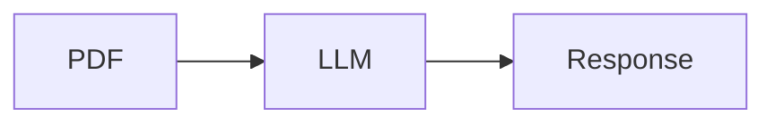
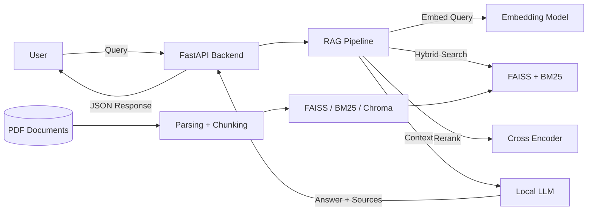
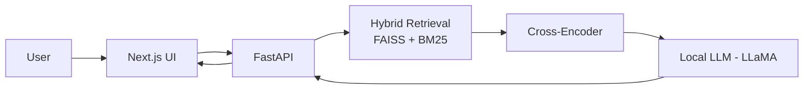
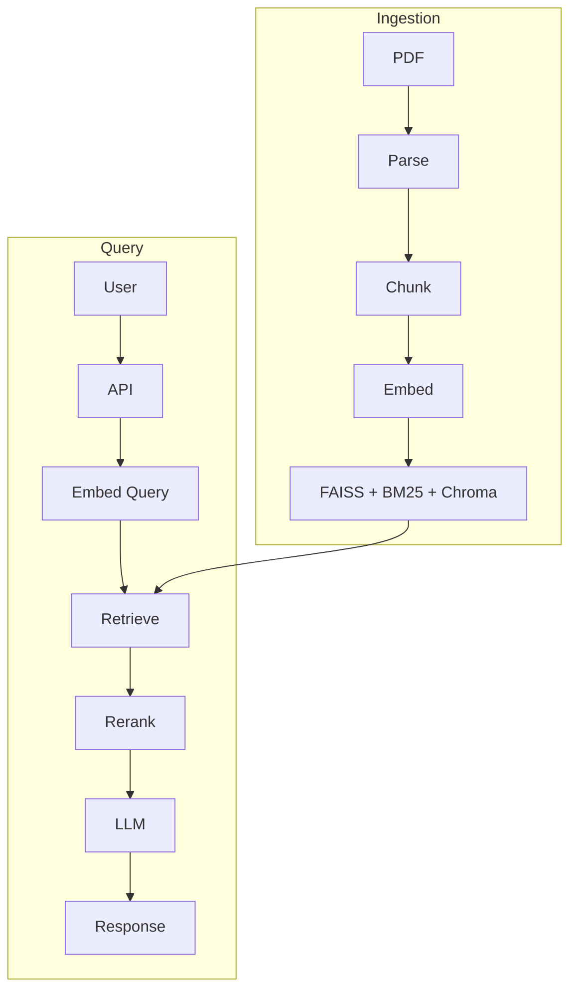

## Choosing the LLM model
for the LLM AI model I should use either:
- DeepSeek-R1 & V3
- Claude 3.7 Sonnet / Claude Opus 4.6
These are what showed the best outputs and accuracy for the documentations.
### Frameworks
for the framework I would love to use LangChain or LlamaIndex. Especially if I want to use it for general applications such as websites and API.

for Offline and local integration using Ollama would  be best practice. 

also Continue.dev is the best open source VS-Code extension for integrating DeepSeek-Coder for IDE.

for Enterprise and personal ideals. 
- DB-gpt for native data AI application frameworks.
- Spring AI, a java framework with Spring Boot. 

### Parsing
I am Willing to use Llama Parse but for the local and free version
- Unstructured
- Docling,
- Vectorize
- Amazon Textract
- MistralOCR
## The project Structure
It starts with a simple question:
Can I more effectively research municipal codes by leveraging AI?
at first my thought process was very high-level.
#### High-level Structure


But after working out the details and researching more about the project and how to accomplish this goal I ended up finding this structure.
#### Proper Structure



But this is a very technical model so to help simplify it, the diagram will look like this:
#### Simplified Structure


For a more clean and structured diagram of the architecture the diagram below will show the components.
#### Civil AI - System Architecture




currently creating LLM with LlamaIndex: 
How to run them both the llamaIndex and the regular one
```
python LlamaIndexRAG/build_index.py
uvicorn app.app_llama:app --reload
```

```
uvicorn app.app:app --reload
```
